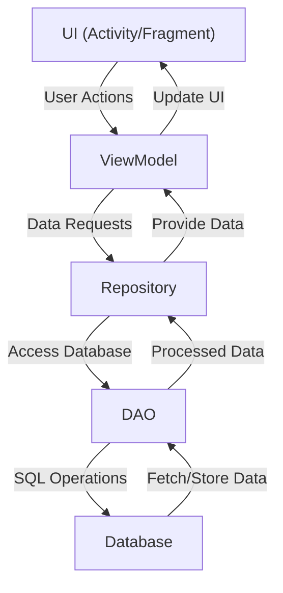

<p align="center">
  
</p>

<div align="center">

### Hook !
##### Link Management Application

 
 
 
<br>
<br>

[](https://play.google.com/store/apps/details?id=com.hanto.hook)

</div>
---

## Features
- 🔗 Save Links (Hook)
- 📂 Organize and Manage Hooks by Topics
- 📝 Provide Annotation Feature for Each Hook
- 📲 Shared links from other apps to Hook

  
---

## Preview


## Tech Stacks

| **Category**    | **Technology**           |
|-----------------|--------------------------|
| Language        | Kotlin                   |
| Architecture    | MVVM, Android App Architecture |
| UI              | XML, Material 3          |
| Concurrency     | Coroutines               |
| Database        | Room DAO                 |
| Navigation      | Jetpack Navigation       |
| App Design      | Modularization           |

🔧Paging

---


## Branch Strategy
The branch strategy for this project follows a simplified Git Flow model, managed using **Sourcetree**.

### Main Branches
- **main**: Contains the production-ready code.
- **work**: Used for integrating features and staging before merging into `main`.


# Android Architecture Overview


This modular architecture ensures a clean and maintainable codebase, adhering to the MVVM (Model-View-ViewModel) design pattern.

```
[UI] ↔ [ViewModel] ↔ [Repository] ↔ [DAO] ↔ [Database]
```

## Diagram


---


