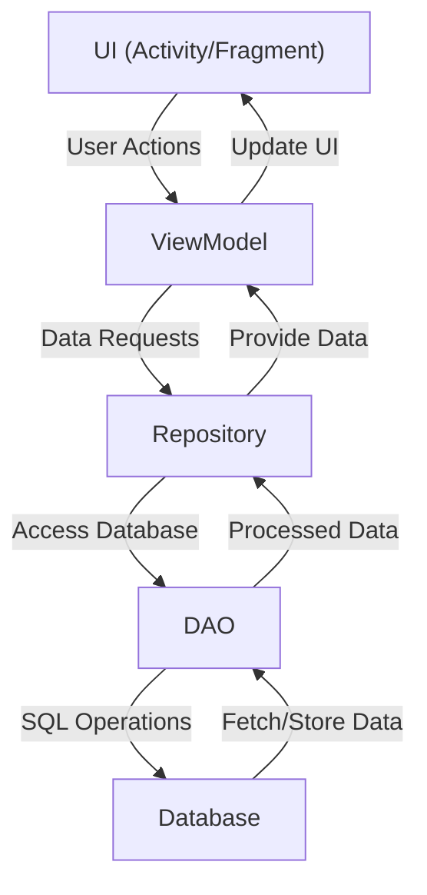

<p align="center">
  
</p>

<div align="center">

### Hook !
##### Link Management Application
<br>
 
 
 
<br>
<br>
Download Link
<br>
https://play.google.com/store/apps/details?id=com.hanto.hook
</div>

---

## Features
- 🔗 Save Links (Hook)
- 📂 Organize and Manage Hooks by Topics
- 📝 Provide Annotation Feature for Each Hook
- 📲 Shared links from other apps to Hook

  
---

## Preview


## Tech Stacks

| **Category**    | **Technology**           |
|-----------------|--------------------------|
| Language        | Kotlin                   |
| Architecture    | MVVM, Android App Architecture |
| UI              | XML, Material 3          |
| Concurrency     | Coroutines               |
| Database        | Room DAO                 |
| Navigation      | Jetpack Navigation       |
| App Design      | Modularization           |

🔧Paging

---

# Android Architecture Overview


This modular architecture ensures a clean and maintainable codebase, adhering to the MVVM (Model-View-ViewModel) design pattern.

```
[UI] ↔ [ViewModel] ↔ [Repository] ↔ [DAO] ↔ [Database]
```
---

## Branch Strategy
The branch strategy for this project follows a simplified Git Flow model, managed using **Sourcetree**.

### Main Branches
- **main**: Contains the production-ready code.
- **work**: Used for integrating features and staging before merging into `main`.

## Components

### **UI**
- Represents the visual layer (e.g., `Activity` or `Fragment`).
- Directly interacts with the `ViewModel`.

### **ViewModel**
- Acts as the bridge between the UI and data layers.
- Requests data from the `Repository` and prepares it for display.
- Maintains data during configuration changes (e.g., screen rotation).

### **Repository**
- Manages data sources and provides a clean API for data access.
- Mediates between `DAO` (local database) and remote sources (e.g., APIs).

### **DAO (Data Access Object)**
- Defines methods to access the database.
- Abstracts SQL queries into method calls.

### **Database**
- Local data storage, typically implemented with Room.
- Stores app data persistently.

---

## Data Flow

1. **UI → ViewModel**
   - User actions (e.g., button clicks) trigger requests to the `ViewModel`.

2. **ViewModel → Repository**
   - The `ViewModel` forwards data requests to the `Repository`.

3. **Repository → DAO**
   - The `Repository` calls the `DAO` to fetch or update data in the database.

4. **DAO → Database**
   - The `DAO` performs the actual database operations.

5. **Repository → ViewModel**
   - The `Repository` processes the data (e.g., applying business logic) and returns it to the `ViewModel`.

6. **ViewModel → UI**
   - The `ViewModel` provides the processed data to the UI for rendering.

---

## Diagram


---


