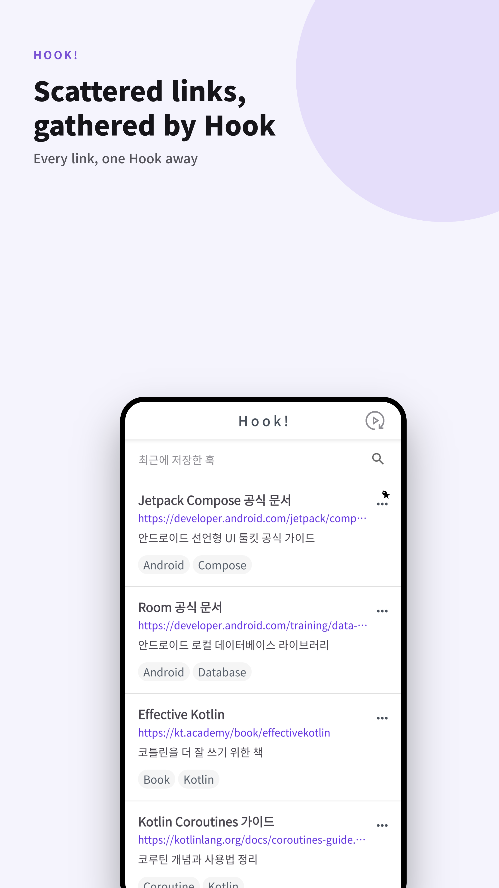
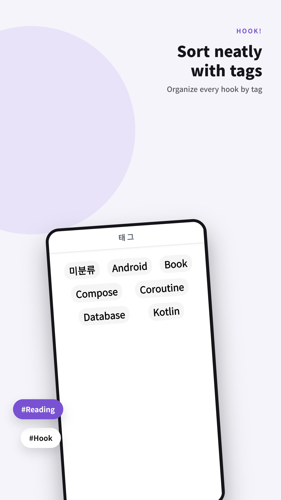
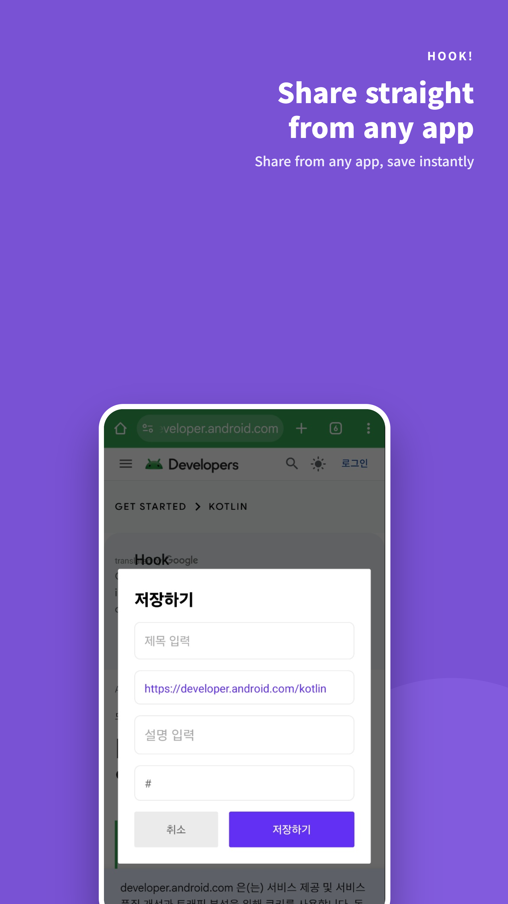
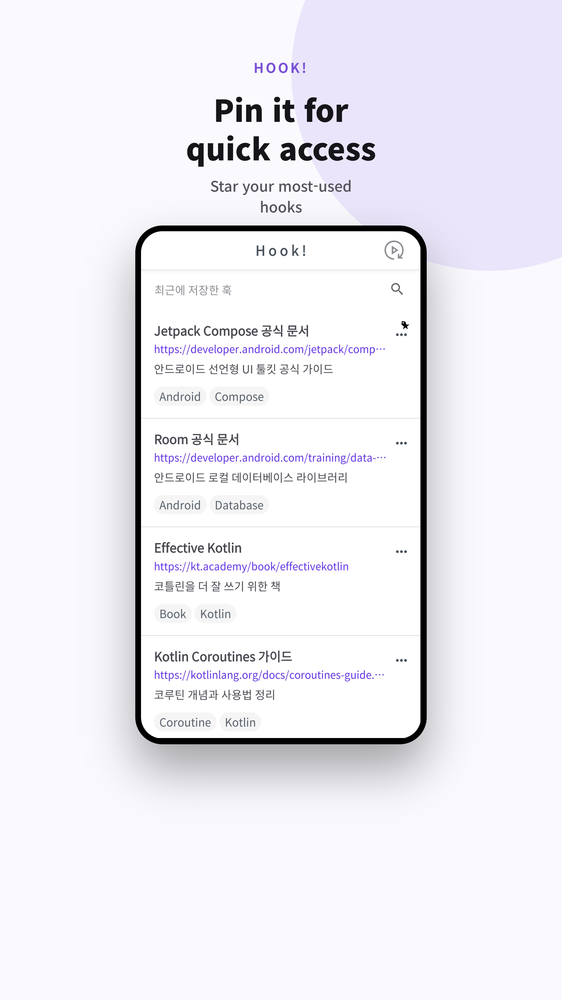

<p align="center">
  
</p>

<h1 align="center">Hook</h1>

<p align="center">
Save links instantly. Organize with tags. Find them anytime.
</p>

<p align="center">
  <a href="https://play.google.com/store/apps/details?id=com.hanto.hook">
    
  </a>
</p>

<p align="center">
  
  
</p>

---

# Overview

Hook is a bookmark manager that lets you save links directly from the Android Share Sheet.

Instead of losing links in chats, notes, or browser bookmarks, Hook keeps them organized with tags, notes, and fast search.

---

# Screenshots

<p align="center">
  
  
  
  
</p>

---

# Features

- 🔗 Save links directly from Android Share Sheet
- 🖼️ Automatically fetch webpage metadata & thumbnails
- 🏷️ Organize bookmarks with tags
- 📝 Add notes to saved links
- 📌 Pin important links

---

# Technical Highlights

- Clean Architecture + MVVM
- UseCase-based business logic
- Room + Flow reactive data handling
- Jsoup-based Open Graph metadata parsing
- Debounce + in-memory search optimization
- Hilt dependency injection

---

# Tech Stack

| Category | Stack |
|----------|-------|
| Language | Kotlin |
| Architecture | Clean Architecture, MVVM |
| Async | Coroutines, Flow |
| UI | XML, ViewBinding, Material 3 |
| Database | Room |
| DI | Hilt |
| Network | Retrofit, OkHttp |
| Parsing | Jsoup |
| Image | Glide |
| Test | JUnit4, MockK, Turbine |

---

# Architecture

```
Presentation
     │
     ▼
Domain (UseCases)
     │
     ▼
Data (Repository)
     ├── Room
     └── Retrofit / Jsoup
```

---

# Project Structure

```
app
├── presentation
├── domain
├── data
├── di
└── common
```

---

# License

This project is licensed under the MIT License.
