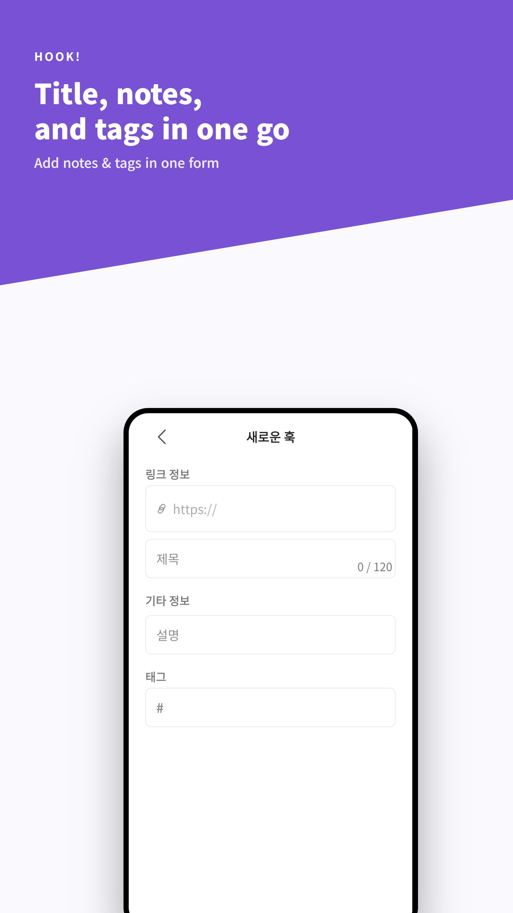
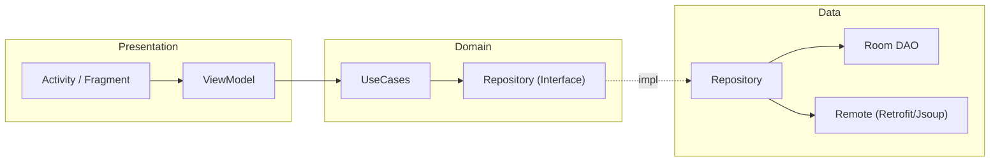

  

<h1 align="center">Hook</h1>

<em>링크를 저장하고, 태그로 정리하고, 다시 꺼내 쓰는 가장 짧은 방법</em>

  
  
  
  

  

 

## Overview

**Hook**은 흩어지는 링크를 한곳에 모아 태그로 분류하고, 메모를 남겨 다시 찾기 쉽게 만드는 링크 관리 앱입니다. 다른 앱에서 공유하기(Share Sheet)로 바로 저장할 수 있어, 링크를 저장하는 데 걸리는 시간을 최소화하는 것을 목표로 합니다.

## Features

| Feature | Description |
|---|---|
| 🔗 **Save** | 다른 앱의 공유 시트를 통해 링크를 즉시 Hook으로 저장 |
| 🖼️ **Preview** | 저장한 링크의 썸네일과 메타데이터를 자동으로 가져와 미리보기 제공 |
| 🏷️ **Organize** | 태그를 기준으로 링크를 분류하고, 태그가 없는 링크는 미분류로 모아보기 |
| 📝 **Annotate** | 각 링크에 메모를 남겨 저장한 이유와 맥락을 함께 보관 |
| 🔍 **Search** | 초성 검색 및 디바운스가 적용된 빠른 인메모리 검색 |
| 📌 **Pin** | 자주 찾는 링크를 상단에 고정 |

## Preview

  
  
  
  
  

---

## Tech Stack

| Category | Technology |
|---|---|
| Language | Kotlin, Coroutines / Flow |
| Architecture | Clean Architecture (Presentation · Domain · Data), MVVM |
| UI | XML View Binding, Material 3 |
| DI | Hilt |
| Database | Room |
| Networking | Retrofit, OkHttp, Jsoup (링크 메타데이터 파싱) |
| Image Loading | Glide |
| Testing | JUnit4, MockK, Turbine |

## Architecture

Hook은 UI, 도메인 로직, 데이터 소스를 분리한 3계층 Clean Architecture를 따릅니다. 각 유스케이스는 단일 책임을 갖도록 세분화되어 있어(`AddHookUseCase`, `SearchHooksUseCase`, `TogglePinUseCase` 등), 비즈니스 로직이 ViewModel에 쌓이지 않도록 합니다.

```mermaid
graph LR
    subgraph Presentation
        UI["Activity / Fragment"] --> VM["ViewModel"]
    end
    subgraph Domain
        VM --> UC["UseCases"]
        UC --> RI["Repository (Interface)"]
    end
    subgraph Data
        RI -.impl.-> RImpl["Repository"]
        RImpl --> DAO["Room DAO"]
        RImpl --> Remote["Remote (Retrofit/Jsoup)"]
    end
```

---

## Commit Convention

커밋 메시지는 목적을 접두사로 구분합니다.

| Prefix | 의미 |
|---|---|
| `feat` | 새로운 기능 추가 |
| `fix` | 버그 수정 |
| `perf` | 성능 개선 |
| `refactor` | 동작 변경 없는 구조 개선 |
| `build` | 빌드 설정, 의존성 변경 |
| `test` | 테스트 추가/수정 |

---

Made with ❤️ by <a href="https://github.com/pointmina">pointmina</a>

